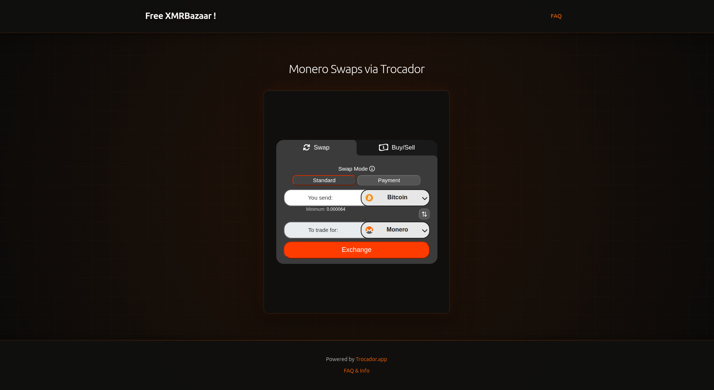
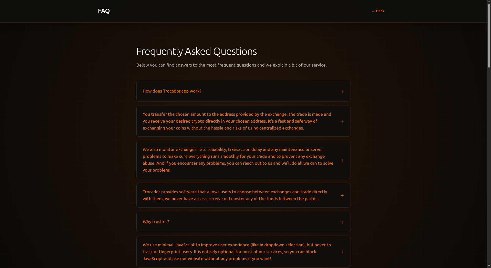

## Trocador Swap Page Generator

Generate a simple swap UI using local or cloud Ollama models that uses your Trocador referral code. Features collapsible FAQs, customizable titles, and a few theme options.

Note - this is just a quick vibe coded script, it's local and is just generating a basic page, shouldn't be any issues but if there is, let me know. It's just a starter, always check the code yourself.

---

### Requirements

- uv ( curl -LsSf https://astral.sh/uv/install.sh | sh )
- Python 3.8+
- Ollama installed and running
- Note > you can use any AI service you like, just ask AI to adjust the script to suit. I just use this for simple stuff because I like that local & cloud is easy to switch between.

---

### Install Ollama (linux)

```bash
curl -fsSL https://ollama.com/install.sh | sh
```

### Wait for install script to finish then enter this command to download a model from here  
https://ollama.com/search:

```bash
ollama run model_name
```

### Ollama links if you get stuck

https://docs.ollama.com/  
https://ollama.com/download

---

### Deploy

(you will need your own secure VPS or a pre-existing website with Nginx setup)

Upload the three files to any static host:

**Nginx**: Basic static file serving

---

### How to run the script

```bash
# Run script in CLI with local model
uv run swap_gen.py

# Run script with cloud model (recommended for custom themes but be mindful of the privacy trade offs)
uv run swap_gen.py --cloud
```

---

## Usage

1. Enter your Trocador referral code (just the code, not the full URL)
2. Set page title (default: "Get Monero")
3. Choose a template (1-5):
   - **Matrix Green** - Classic hacker aesthetic with green accents
   - **Monero Orange** - Monero-inspired orange theme (#ff6600)
   - **Purple Cyber** - Cyberpunk purple aesthetic
   - **Blue Terminal** - Terminal-style blue theme
   - **Custom** - Describe your aesthetic, AI generates color scheme (not currently working)

4. Files generated in `./output/`:
   - `index.html` - Main swap page with enhanced styling
   - `faq.html` - Collapsible FAQ page
   - `style.css` - Professional cyberpunk styles

---

### Test Locally

```bash
cd output
python3 -m http.server 8000 --bind 127.0.0.1
```

Visit: `http://localhost:8000`

Note: `--bind 127.0.0.1` ensures the server only accepts connections from your machine (localhost only, more secure).

---

### Features

### FAQ Page

- Collapsible questions (click to expand/collapse)
- Minimal JavaScript for dropdown functionality
- All content from official Trocador documentation
- Themed styling matching main page

### Customization

- Custom page titles for personal touch
- 4 preset professional themes
- AI-generated custom color schemes (in progress - if I feel like finishing it)
- All elements adapt to chosen theme (iframe stays the same colors)

---

### Basic Security Features (quick vibe code, don't expect the world)

- HTML escaping for XSS protection
- Input validation on referral codes
- Subprocess timeout protection
- No shell injection vulnerabilities
- Secure iframe attributes (rel="noopener")
- Minimal JavaScript (only for FAQ dropdowns)

---

### Notes

- Referral code input: just the code (e.g., `abc123`), not full URL. Get this from Trocador
- Page title appears in both header and browser tab
- FAQ dropdowns collapse by default for cleaner UI

---

### File Structure

```
swap_gen.py          # Main generator script
output/
  ├── index.html     # Swap page
  ├── faq.html       # FAQ page with dropdowns
  └── style.css      # Theme styles
```

---

### Screenshots

Main Swap Page  


FAQ Page  


Green Swap Page  


---
